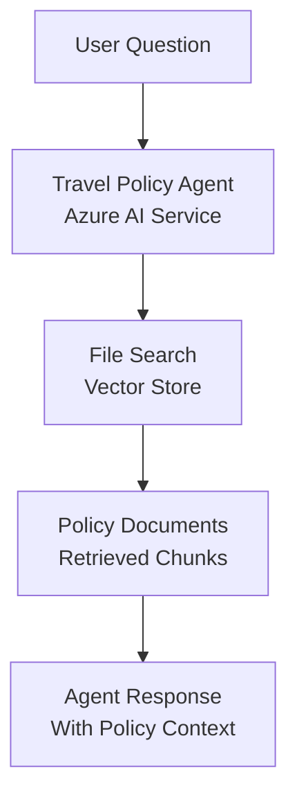

# Travel Policy Compliance Agent - Challenge 05 Solution (Python)

This is the Python solution for Challenge 05. This project implements an AI agent using Azure AI Agent Service that can answer questions about company travel policies using file search and retrieval.

## Features

- **Document-Aware AI Agent**: Agent has knowledge of your complete travel policy
- **File Search Capability**: Automatically retrieves relevant policy sections
- **Persistent Conversations**: Maintains context across multiple questions
- **Azure AI Service**: Managed agent hosting and scaling
- **Natural Language Understanding**: Answers complex policy questions naturally

## Architecture



## Setup

### Prerequisites
- Azure subscription with AI Agent Service access
- Pre-configured agent in Azure AI Foundry with file search enabled
- Python 3.10+

### Installation

**For faster dependency management, consider using `uv`:** [`uv` is an extremely fast Python package installer and resolver](https://docs.astral.sh/uv/). It's significantly faster than `pip` (10-100x in many cases) and handles dependency resolution more efficiently. You can install it from https://docs.astral.sh/uv/getting-started/installation/.

**Using `uv` (recommended for performance):**
```bash
uv venv .venv
source .venv/bin/activate  # Windows: .venv\Scripts\activate
uv pip install -r requirements.txt
```

**Or using standard `pip`:**
```bash
python -m venv .venv
source .venv/bin/activate  # Windows: .venv\Scripts\activate
pip install -r requirements.txt
```

### Configuration

Create a `.env` file:
```env
AZURE_AI_FOUNDRY_PROJECT_ENDPOINT=your_agent_service_endpoint
AZURE_AI_AGENT_ID=your_agent_id
```

### Running the Agent

```bash
python travel_policy_agent.py
```

## Usage Examples

```
You: What's the daily meal allowance limit?
Advisor: According to the policy, the daily meal allowance is $65 for domestic travel...

You: Can I book a flight with a different airline than the preferred carriers?
Advisor: The policy allows flights with non-preferred airlines under these circumstances...

You: How do I request an exception?
Advisor: Exceptions require approval from the Travel Department...
```

## Success Criteria Met

- ✅ AI Agent built with Azure AI Agent Service
- ✅ File search capability for policy documents
- ✅ Answers travel policy questions accurately
- ✅ Maintains conversation context
- ✅ Professional guidance on compliance

## Learning Resources

- [Azure AI Agent Service](https://learn.microsoft.com/en-us/azure/ai-services/agents/)
- [File Search with Agents](https://learn.microsoft.com/en-us/azure/ai-services/agents/file-search)
- [Azure Identity Authentication](https://learn.microsoft.com/en-us/python/api/azure-identity/)
